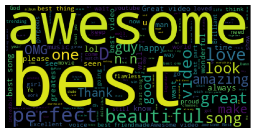

# youtube-analysis

# 1. Sentiment analysis on Youtube comments

The first analysis is regarding a database with comments from multiple YouTube videos. 
I used TextBlob, a NLP library to perform the sentiment analysis and Wordcloud library to present the most common words, in positive and negative comments, in a visual and appealing way. Since emojis are so common nowaday, I also did some analysis regarding emojis in the comments. 

File: YT_comments_sentiment_analysis.ipynb 

## Sentiment Analysis
For the sentiment analysis, using TextBlob, I only considerer the high positive (polarity=1) and high negative(polarity=-1). 

| | Count | Percentage of total |
| -------- | ------- | ---------- |
| High Positive | 19391 | 6.22% |
| High Negative | 3508 | 0.51% |

 
The most common words for each were: 
High Positive 
 

High Negative 

## Emoji Analysis

# 2. Youtube Category Analysis

[Objetivo da analise]

File: YT_category_analysis.ipynb

[Conclusões por alto]