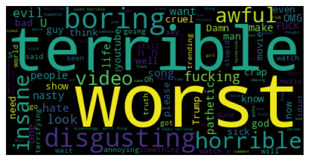
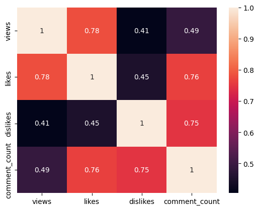

# youtube-analysis

# 1. Sentiment and Emoji analysis on Youtube comments

The first analysis is regarding a database with comments from multiple YouTube videos. 
I used TextBlob, a NLP library to perform the sentiment analysis and Wordcloud library to present the most common words, in positive and negative comments, in a visual and appealing way. Since emojis are so common nowaday, I also did some analysis regarding emojis in the comments. 

## Sentiment Analysis
For the sentiment analysis, using TextBlob, I only considerer the high positive (polarity=1) and high negative(polarity=-1). 

| | Count | Percentage of total |
| -------- | ------- | ---------- |
| High Positive | 19391 | 6.22% |
| High Negative | 3508 | 0.51% |

 
The most common words for each were: 

High Positive 

High Negative 

## Emoji Analysis
As for the emoji analysis, I found the top 10 most used emojis, see below: 

From this graph we can see that most emojis are positive emojis, laughing, love/heart, claps.

# 2. Youtube Category Analysis

The second analysis is regarding video category and shows. 
Given the amount of shows and videos all over Youtube (this dataset has more than 300k entries), I decided to make four questions:
1. Which Category has the most likes?
2. Is the the audience engaged?
3. Which channels have the trendiest shows?
4. Does Punctuation in the Title have any relation with views, likes, dislikes?

## 1. Which Category has the most likes?
Top 10 most liked categories 

As we can easily see, the Music category far surpasses all other categories with almost 6 billion likes.

## 2. Is the the audience engaged?
To understand if the audience is engaged, I look to views, likes, dislikes, and comment counts. 

Regression plots: 

All three regressions are positive, meaning that as views increase, so do likes, dislikes, and comments. 
The corelation between views and likes is clearly the biggest, with 0.78 of correlation, as shown in the correlation matrix below: 

From the plots and the correlation matrix, it's safe to assume that as views go up, so does the engagement from the viewers.

## 3. Which channels have the trendiest shows?
Top 10 trendiest shows 

From the plot we can see that there isn't much discrepancy between shows. Nevertheless, "The Late Show with Stephen Colbert" is number one on the list. 
Another curious conclusion is that 6 of the 10 shows are Host Shows, 5 of them Night Host Shows.

## 4. Does Punctuation in the Title have any relation with views, likes, dislikes?
To understand the how does punctuation in titles affect views, likes, or dislikes, I did an analysis based on the number of views, likes, or dislikes for titles with different count of punctuation characters. 

The punctuation characteres considered were: !"#$%&\'()*+,-./:;<=>?@[\\]^_`{|}~ 

Bar plots: 

We can take some conclusions from the plot: 
1. videos with 8 punctuation characters have the most number of Views and Likes
2. Most of views, likes, and dislikes, happen in videos with punctuation chars count between 0 and 11
3. Except for dislikes, as the number of puctuation chars count increases, there is less engagement from viewers.

# Future Work
- Go more in depth in the analysis. For example, instead of aggregate all countries data, do an analysis by country.
- Create a Tableau/PowerBI dashboard where is it possible to show this findings dynamically